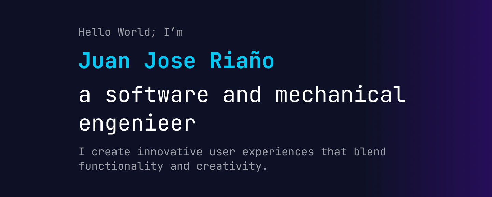

<h1 align="center">Hola, soy <a href="https://aristi.dev">Juan José Riaño Zabaleta</a> 👋</h1>

## Sobre mí

- 🌐 Desarrollador web full-stack enfocado en experiencias inmersivas e interactivas  
- 🧠 Fusiono programación, diseño 3D y herramientas modernas para crear proyectos únicos  
- 🕹️ Apasionado por los videojuegos, realidad aumentada y entornos virtuales  
- 🎨 Modelador 3D y diseñador de experiencias para metaverso (Spatial, Unity, WebGL)  
- 🚀 Siempre en búsqueda de nuevas formas de conectar tecnología, arte y aprendizaje  
 

## Proyectos destacados
<table>
<tr>
<td width="50%">
<h3 align="center">🏛️ Museo de Patología (Patology Museum)</h3>

Una aplicación de realidad virtual 3D completamente personalizada que ofrece visualización inmersiva de modelos anatómicos con diversas patologías. Este museo virtual permite a los usuarios explorar entornos interactivos del metaverso, con modelos originales diseñados, esculpidos y texturizados desde cero.

</td>

<td width="50%">
<h3 align="center">🌐 ArcovXR</h3>

Página web avanzada de una consultora en tecnologías emergentes, donde se evidencia el uso de manejo de estados, efectos visuales y enrutamiento dinámico de ventanas. Además, integra tecnologías de última generación como la visualización de modelos 3D diseñados desde cero para experiencias web interactivas.

  
</td>
</tr>
</table>

 

<table>
<tr>
<td width="50%">
<h3 align="center">📱 Clon de TikTok (TiktokClone)</h3>

Aplicación móvil inspirada en TikTok, con visualización dinámica e interactiva de videos, integrada con Supabase para su respectiva funcionalidad y actualizaciones en tiempo real. Desarrollada con React Native.

  
</td>
</tr>
</table>

 

